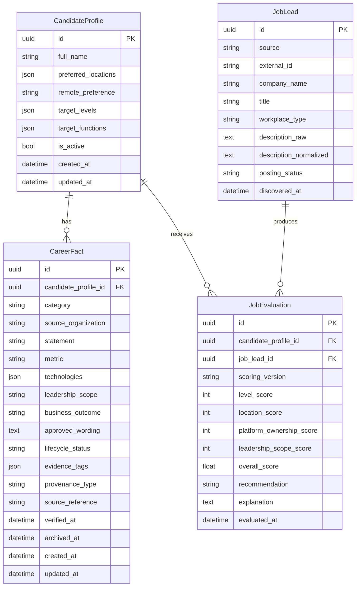

# Architecture

The foundation slice keeps deterministic business rules in the domain layer and uses FastAPI and SQLAlchemy only as delivery and persistence adapters.

The current vertical slice extends that foundation with a reviewed candidate knowledge base: one active candidate profile, canonical career facts, explicit lifecycle transitions, typed provenance, and controlled evidence tags that feed deterministic scoring.

## Layering

- `domain`: enums, workflow rules, scoring, and immutable snapshots.
- `application`: explicit use-case functions for create, retrieve, transition, and evaluate flows.
- `infrastructure`: SQLAlchemy models, session management, and the seed command.
- `api`: versioned HTTP endpoints and transport schemas.

## Request Flow

1. FastAPI validates request payloads with Pydantic v2 schemas.
2. Application services orchestrate explicit use cases.
3. Domain rules score jobs and validate workflow transitions without depending on web or ORM frameworks.
4. SQLAlchemy persists normalized entities and explainable evaluation output.

## Initial Entity Diagram

## Maintainability Notes

- Workflow transitions are centralized in domain code, not scattered across endpoints.
- Candidate-profile and career-fact web routes reuse the same application services as the JSON API instead of making internal HTTP calls.
- Evaluation stores each component score independently so later scoring revisions remain auditable.
- Raw job text is preserved alongside normalized text to keep provenance intact.
- Typed JSON collections are limited to fields that are naturally list-shaped in this slice.
- Controlled evidence tags intentionally replace free-form tagging or LLM extraction so scoring remains deterministic and queryable.

## Single-Candidate Scope

The application is currently scoped to one active candidate profile.

- Application services reject creation of a second active candidate.
- Persistence adds a unique active-candidate index as a backstop.
- The web workflow treats `/candidate` as both first-run setup and the single profile management surface.

This is a deliberate product simplification, not a limitation of the core domain model. Multi-candidate support can be introduced later by relaxing the active-candidate index, adding explicit candidate selection in the UI and API, and threading a selected candidate ID through the existing application-service methods without rewriting lifecycle or scoring rules.

## Evaluation Enrichment

The current scoring version is `candidate_evidence_v2`.

- Technical alignment is driven by deterministic job-signal matching against verified evidence tags.
- Leadership scope uses verified leadership tags plus structured leadership fields.
- Draft and archived facts are excluded from evaluation.
- Explanations list matched verified evidence, positive signals, concerns, and missing evidence so the output remains inspectable.

## Web Console Note

The thin web console uses server-rendered Jinja2 templates plus targeted HTMX fragment updates instead of a SPA. That choice keeps state on the server, avoids a second deployment surface, and fits the single-user, workflow-heavy review loop where clarity and maintainability matter more than rich client interactivity.

The presentation layer still depends on the same application services as the JSON API rather than making internal HTTP calls. If a richer frontend is needed later, the current web routes can be replaced without rewriting domain rules, scoring logic, workflow validation, or persistence behavior.
