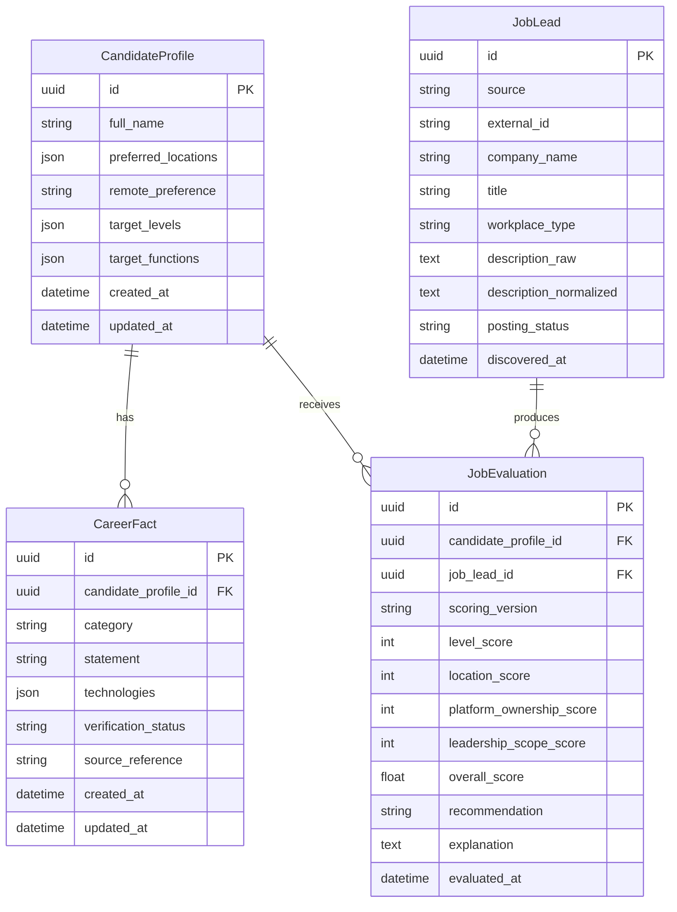

# Architecture

The foundation slice keeps deterministic business rules in the domain layer and uses FastAPI and SQLAlchemy only as delivery and persistence adapters.

## Layering

- `domain`: enums, workflow rules, scoring, and immutable snapshots.
- `application`: explicit use-case functions for create, retrieve, transition, and evaluate flows.
- `infrastructure`: SQLAlchemy models, session management, and the seed command.
- `api`: versioned HTTP endpoints and transport schemas.

## Request Flow

1. FastAPI validates request payloads with Pydantic v2 schemas.
2. Application services orchestrate explicit use cases.
3. Domain rules score jobs and validate workflow transitions without depending on web or ORM frameworks.
4. SQLAlchemy persists normalized entities and explainable evaluation output.

## Initial Entity Diagram

## Maintainability Notes

- Workflow transitions are centralized in domain code, not scattered across endpoints.
- Evaluation stores each component score independently so later scoring revisions remain auditable.
- Raw job text is preserved alongside normalized text to keep provenance intact.
- Typed JSON collections are limited to fields that are naturally list-shaped in this slice.